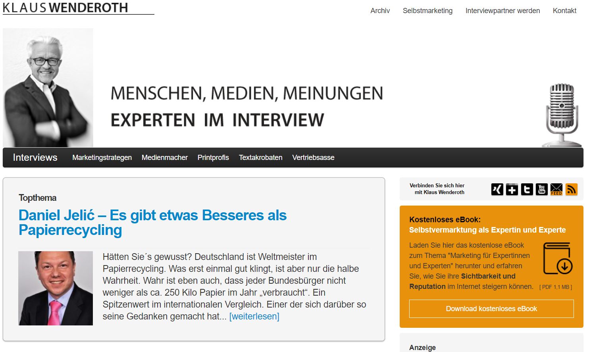
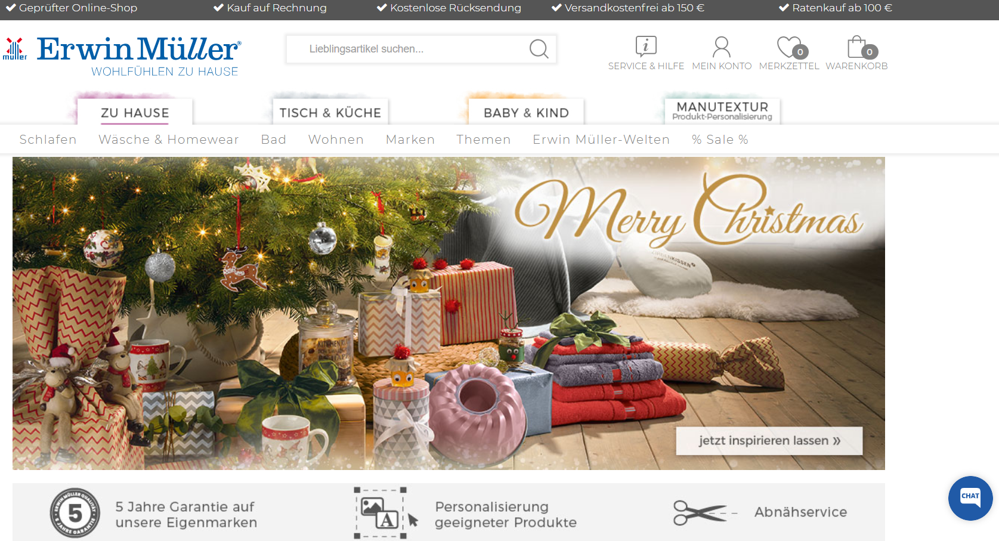
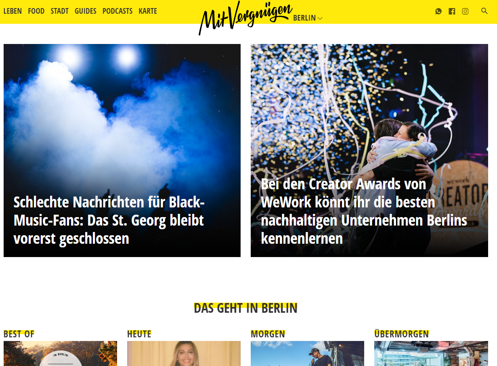

<!-- .slide: data-background="images/technology.jpg" -->
# Das Jimdo-Baukaustensystem

**Internetseitengestaltung für Privatanwender**

----

## Aufbau
- Organisatorisches
- Überblick über das Internet
 - Blog
 - Homepage
 - Forum
 - Soziale Netzwerke
- Wie funktioniert das Internet?
- Was bietet Jimdo?
- Auf gehts: Lass uns arbeiten

---

<!-- .slide: data-background="images/office.jpg" -->
# Organisatorisches

----

### zuerst: Das Kennenlernen
- geboren in Leipzig
- Studium Technische Universität Ilmenau: *Ingenieurinformatik*
- Softwareentwickler bei check24
- privater Nachhilfelehrer
- Dozent an der VHS Leipzig

<i class="fa fa-mobile" aria-hidden="true"></i> 0173 74 29 379

<i class="fa fa-envelope" aria-hidden="true"></i> [kontakt@david-pauli.de](mailto:kontakt@david-pauli.de)

<i class="fa fa-home" aria-hidden="true"></i> [www.david-pauli.de](http://www.david-pauli.de)

---

<!-- .slide: data-background="images/background.jpg" -->
# Was bietet das Internet

----

## Blog

- 'Tagebuch' zum Sammeln von regelmäßigen Erfahrungen
- meist bestimmtes Thema
- Gruppe von Blog-Besitzern erstellt Einträge
- (Leser können kommentieren)

----

### Quelle: klauswenderoth.de

----

### Quelle: planetbackpack.de

----

### Quelle: mymonk.de

----

### Quelle: gedankenpower.com

----

### Quelle: schreibsuchti.de

----

## Gästebuch

- Gäste können Gedanken und Kommentare hinterlassen
- Besitzer administriert das Gästebuch
- Kommunikation in nur eine Richtung

----

## Forum

- Erfahrungsaustausch und Kommunikation über bestimmte Themen
- Moderation durch 'Moderatoren'

----

### Quelle: ioff.de

----

### Quelle: motor-talk.de

----

### Quelle: worldofplayers.de

----

## Chat

- Sofort-Kommunikation zwischen 2 Seiten
- meist auf bestimmte Themen spezialisiert 

----

## Shop

- Verkauf von Waren, meist themenspezialsiert

----

### Quelle: lidl.de

----

### Quelle: roller.de

----

### Quelle: erwinmueller.com

----

## Vlog / PodCast

- 'Tagebücher' durch Videos / Audio
- Präsentation von Inhalten z.B auf Videoplattformen wie *YouTube*

----

### Quelle: festundflauschig.de

----

### Quelle: mitvergnuegen.com

----

### Quelle: viertausendhertz.de

---

<!-- .slide: data-background="images/phone.jpg" -->
# Wie funktioniert das Internet?

---

<!-- .slide: data-background="images/marshmallows.jpg" -->
# Was bietet Jimdo?

----

## Die Jimdo-Pakete

----

### Jimdo Free (kostenfrei)

- 500 MB Speicherplatz
- HTTPS-Verschlüsselung
- passwortgeschützte Bereiche
- Kontaktformulare

----

### Jimdo Pro (5 € / Monat)

- 5 GB Speicherplatz
- &#43; Internet-Adresse + E-Mail-Adresse
- werbefrei
- optimiert für mobile Geräte 

----

### Jimdo Business (15 € / Monat)

- unbegrenzter Speicherplatz
- 20 E-Mail-Adressen
- Suchmaschinenoptimierung
- Standard-Shop

----

### Jimdo Shop (20 € / Monat)
- &#43; weitere Zahlungsmööglichkeiten

----

### Platin (35 € / Monat)
- Experten-Bewertung der Webseite

----

## Was bietet Jimdo noch?

----

### Viele kostenfreie Designs
- Design sofort anpasssen
- freie Wahl sooft man möchte
- Anpassungen an Designs
 - Bilder
 - Schriftarten und - größe
 - Farben
- jedes ist suchmaschinenoptimiert
- jedes ist für mobile Ansicht optimiert

----

### Steuerung via App
- Inhalte einfügen auch unterwegs mit App Handy / Tablet
- kostenfrei
- verfügbar für Android & iOS
- schnell Inhalte teilen
- Statistiken unterwegs dabei

----

### Der erste Online-Shop
- rechtssicher
- viele Zahlungsmöglichkeiten (Paypal, SOFORT Überweisung, ...)
- Handy und Google optimiert
- Daten sichern
- Gutscheine für Kunden rausgeben

---

<!-- .slide: data-background="images/thought.jpg" -->
# Die erste Idee & das erste Konzept

---

<!-- .slide: data-background="images/nobody.jpg" -->
# Los geht's!