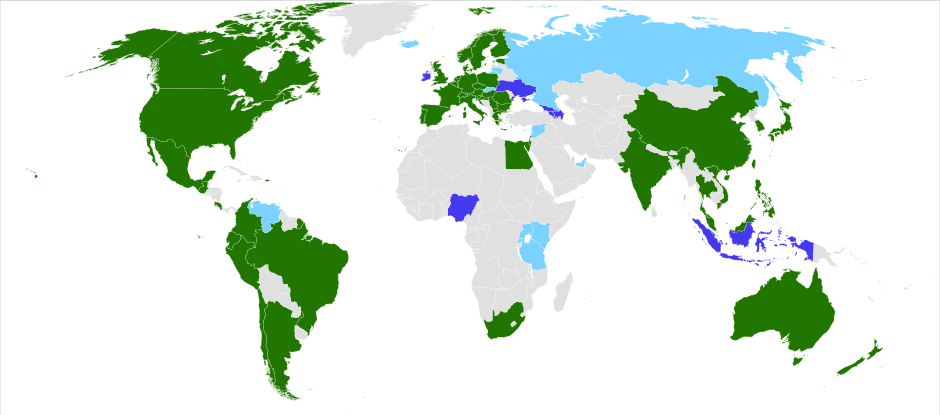

# Das Jimdo-Baukaustensystem

**Internetseitengestaltung für Privatanwender**

----

## Aufbau
- Rechtliches
- Fotos & Bilder
- Schriftarten
- Suchmaschinenoptimierung
- sinnvolle Werkzeuge

---

<!-- .slide: data-background="images/study.jpg" -->
# Rechtliches

----

## Urheber- und Verwertungsrecht

----

### Urheberrechtsgesetz

- **Urheberrecht** besitzt *immer* Urheber
- bis 50 bzw 70 Jahre nach Ende des Urheber-Todes

----

### Verwertungsrecht

- **Verwertungsrecht** kann unterschiedlich ausgehandelt werden, z.B.
- *Person 1* darf ein Bild kostenlos einbinden
- *Person 2* muss 100 € zahlen und darf es nur in Videos einbinden, die 20x pro Monat aufgerufen werden
- kann mündlich oder schriftlich gegeben werden
- das Recht ein Medium einzubinden sollte immer mit dem Urheber geklärt werden

----

## Impressumsplicht

- deutscher Diensteanbieter muss ein Impressum besitzen, siehe Telemediengesetz
- leicht erkennbar / verfügbar
- Name, Anschrift, E-Mail-Adresse / Telefonnummer
- bei Firmen alle wichtigen Firmeninformationen (wie USt-IdNr.)

----

## Shop: Verbraucherrechte

----

### Widerrufsrecht

- bei Online-Handel (ebenso Haustür- / Telefonverkauf) darf Kunde dem Kauf widerrufen
- kein Grund nötig
- 14 Tage ab Erhalt der Widerrufsbelehrung bzw Erhalt der Ware
- Rücksendekosten ab 40 € Warenwert trägt Händler

----

### Garantie & Gewährleistung

- **Gewährleistung** durch Gesetz geschützt: (normalerweise) 2 Jahre
  - erste 6 Monate hat Händler Pflicht den nicht vorhasndenen Schaden zu beweisen
  - danach: der Kunde
- **Garantie** wird vom Händler als Bonus verkauft
  - unterschiedlichste Bedingungen

----

## Marken- und Patentrecht

- Schutz von Marken, Mustern oder Erfindungen in Deutschland, Europa oder anderem Land
- Recherche bei z.B. [DPMAregister](https://register.dpma.de/DPMAregister/marke/einsteiger) oder [EPO PATLIB](https://www.epo.org/searching-for-patents/helpful-resources/patlib_de.html)
- muss regelmäßig erneuert werden

---

<!-- .slide: data-background="images/tea.jpg" -->
# Fotos & Bilder

----

## gängige Lizenzmodelle

- grundsätzlich müssen Bilder nicht verwertbar sein
- es gibt kein Lizenzrecht, was automatisch gilt
- Nutzungs-Lizenz von Bilder-Börsen
- Creative Commons als 'Sammelbecken' für Medien

----

### Creative Commons

- aufgebaut mit Modulen
- gültig in zahlreichen Ländern weltweit

----

### CC-Module

- **by**: Namensnennung
- **nc**: nicht kommerziell
- **nd**: keine Bearbeitung
- **sa**: Weitergabe unter gleichen Bedingungen
- **CC0**: Komplett freie Nutzung ohne Einschränkung

----

#### [iStock](https://www.istockphoto.com/de)

- Einzelkauf von Fotos um ca 29€/Foto (Standardlizenz)
- erweiterte Lizenzen z.B. unbegrenzte Reproduktionen
- auch Abo verfügbar (ab 35€/Monat für 10 Bilder)
- ähnlich auch [Shutterstock](https://www.shutterstock.com/de/) oder [Fotolia](https://de.fotolia.com/)

----

#### kostenfreie Bilder

- Portale wie [piqs.de](http://piqs.de/) oder [Pixabay](https://pixabay.com/de/) mit CC-Lizenz
- eigene Lizenzen bei z.B. [Pixelio](https://www.pixelio.de/)

----

#### besondere Fotoportale

- viele aktuelle Fotos bei [GettyImages](http://www.gettyimages.de/)
- untypische Fotos bei [Photocase](https://www.photocase.de/)

----

### beauftragte Fotos

- Online-Bilder können von vielen anderen auch benutzt werden
- Möglichkeit 1: (lokale) Fotografen beauftragen
- Möglichkeit 2: selbst fotografieren

---

<!-- .slide: data-background="images/typography.jpg" -->
# Schriftarten

----

## Schriftarten

- haben ebenso ein Urheberrecht / Verwertungsrecht
- Seiten wie [dafont](https://www.dafont.com/de/) bieten eine Übersicht

---

<!-- .slide: data-background="images/hand.jpg" -->
# Suchmaschinenoptimierung

----

## Was ist Suchmaschinenoptimierung?

- häufigster Einstiegspunkt sind Suchmaschinen

---

<!-- .slide: data-background="images/confused.jpg" -->
# sinnvolle Werkzeuge

----