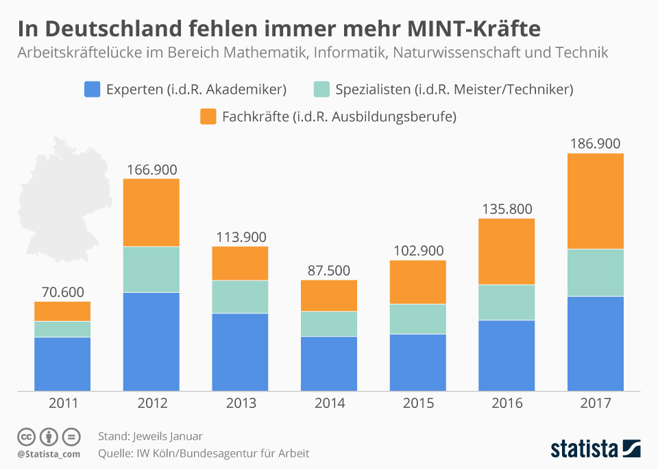

# mBots
<!-- .slide: data-background="images/alex-knight-199368.jpg" -->

**Roboter mit Scratch programmieren**

----
## Aufbau

- kurze Vorstellung
- aktueller Stand der Technik
- Lehrpläne & die Bildung
- Was kann der mBot?
- _*Beispiel:*_ erfolgreicher mBot-Kurs
- weitere Beispiele: Robotik im Schulsystem

---
# kurze Vorstellung
<!-- .slide: data-background="images/michelangelo-71282_1280.jpg" -->

----
## Wer bin ich?
- geboren in Leipzig
- Studium TU Ilmenau: *Ingenieurinformatik*
- Softwareentwickler bei check24
- ehem. privater Nachhilfelehrer
- Dozent an der VHS Leipzig
- politisch aktiv bei V-Partei³

<i class="fa fa-mobile" aria-hidden="true"></i> 0173 74 29 379

<i class="fa fa-envelope" aria-hidden="true"></i> [kontakt@david-pauli.de](mailto:kontakt@david-pauli.de)

<i class="fa fa-home" aria-hidden="true"></i> [www.david-pauli.de](http://www.david-pauli.de)

---
# Aktueller Stand der Technik
<!-- .slide: data-background="images/technic-1736312_1920.jpg" -->

----
## Gesichter
<iframe width="1000" height="500" src="https://www.youtube.com/embed/eZlLNVmaPbM?rel=0&amp;showinfo=0" frameborder="0" allow="autoplay; encrypted-media" allowfullscreen></iframe>

----
## Wasserbewegungen
<iframe width="1100" height="500" src="https://www.youtube.com/embed/nGa3g2Hifzc?rel=0&amp;showinfo=0" frameborder="0" allow="autoplay; encrypted-media" allowfullscreen></iframe>

----
## Spinne
<iframe width="1100" height="500" src="https://www.youtube.com/embed/-vVblGlIMgw?rel=0&amp;showinfo=0&amp;start=340" frameborder="0" allow="autoplay; encrypted-media" allowfullscreen></iframe>

----
## gegenseitige Hilfe
<iframe width="1100" height="500" src="https://www.youtube.com/embed/fUyU3lKzoio?rel=0&amp;showinfo=0" frameborder="0" allow="autoplay; encrypted-media" allowfullscreen></iframe>

---
# Lehrpläne & die Bildung
<!-- .slide: data-background="images/books-1185628_1920.jpg" -->

----
## Robotik in der Schule?

> [...] benötigen die Schüler fachwissenschaftlich fundiertes, anwendungsbereites Wissen für ein grundlegendes Technikverständnis, für den Umgang mit Modellen, [...]

*Lehrplan Gymnasium Informatik*

----
## Ab welchem Alter?

- Erfahrungen zeigen ab Klasse 7
- teilweise sogar Klasse 5/6

----
## In welchen Lernbereich passt es?

- EVA-Prinzip *(Kl. 7)*
- einfacher Algorithmusbegriff *(Kl. 8)*
- Implementierung ausgewählter Datenstrukturen in einer Programmierumgebung *(Oberstufe)*

----
## Wie gehts weiter?


----
## Frauen & Männer in MINT-Fächern

> Die Beschäftigung von Frauen in MINT-Berufen [...] ist dabei prozentual deutlicher gewachsen als die von Männern.

Arbeitsagentur: Statistik/Arbeitsmarktberichterstattung, März 2016

----
## Frauen & Männer in MINT-Fächern

> Der Frauenanteil an den Beschäftigen in MINT-Berufen ist [...] langsam steigend, jedoch mit 15 Prozent noch immer deutlich unterdurchschnittlich.

Arbeitsagentur: Statistik/Arbeitsmarktberichterstattung, März 2016

----
## Frauen & Männer in MINT-Fächern

> Der Frauenanteil an allen MINT-Arbeitslosen lag bei 14 Prozent.

Arbeitsagentur: Statistik/Arbeitsmarktberichterstattung, März 2016

----
## Frauen & Männer in MINT-Fächern

> [...] bei Frauen hat das Interesse an den MINT-Studienfächern weiter zugenommen. Der Frauenanteil betrug aber lediglich 28 Prozent.

Arbeitsagentur: Statistik/Arbeitsmarktberichterstattung, März 2016

---
# Was kann der mBot?
<!-- .slide: data-background="images/wall-e-1872683_1920.jpg" -->

----
## Eckdaten
- aus [Kickstarter-Projekt](https://www.kickstarter.com/projects/makeblock/mbot-49-educational-robot-for-each-kid?lang=de) entstanden
- Ziel: kostengünstiger, erweiterbarer Roboter
- vertrieben durch *Makeblock* in zahlreichen Shops

----
# Basis-Set
- 

----

---
## Sind wir nicht alle ein bisschen EVA?
- *E*ingabe --> Sensoren
- *V*erarbeitung --> Gehirn
- *A*usgabe --> Motoren / Aktoren

---
# Lasst uns ein Roboter sein

----
## Blocktypen

### [Befehl]
```
[stehe auf]
[gehe zur Schule]
```

----
## Blocktypen

### &lt;Bedingungen&gt;
```
<wenn vor um 7>
<wenn draußen Schnee>
```

----
## Blocktypen

### []Wiederholungen]
```
[Solange bis 9 Uhr]
   [...]
```

----
## Das Problem des frühen Aufstehens

----
## Der Weg durchs Labyrinth
- Mögliche Blöcke:

```
[Schritt nach vorn]
[Drehe dich nach rechts]
<Wenn eine Wand vor dir>
```
