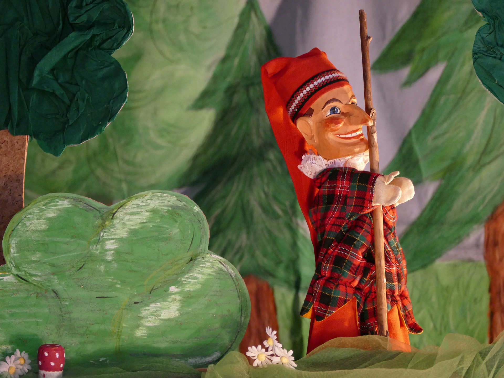
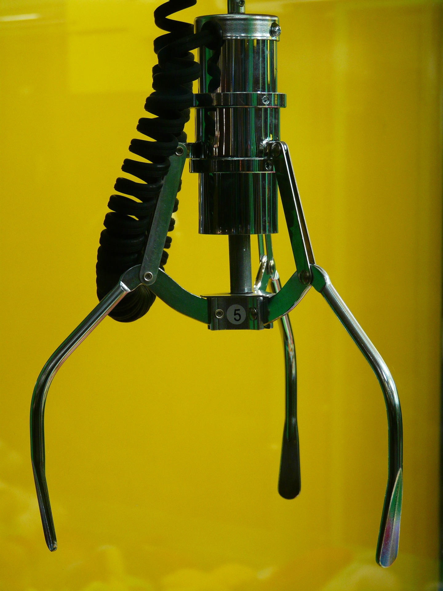
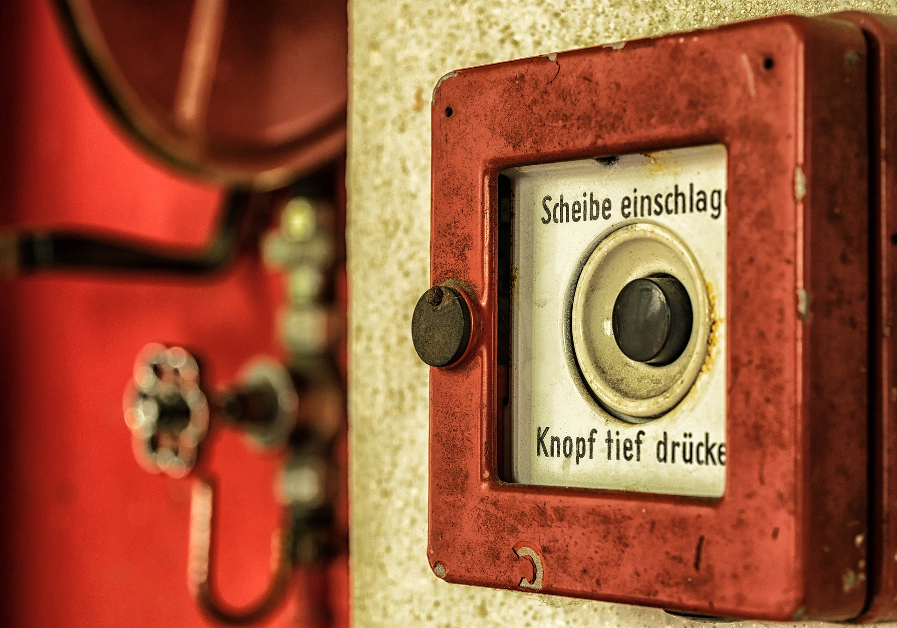

# mBots
<!-- .slide: data-background="images/alex-knight-199368.jpg" -->

**Roboter mit Scratch programmieren**

----
## Aufbau

- Vom Menschen über die Puppe zum Roboter
- Teile des Roboters
 - Arme, Beine, Köpfe: Die Motoren
 - 'Ich kann fühlen': Die Sensoren
 - Das 'Gehirn' des Roboters
 - Sind wir nicht alle ein bisschen EVA?
- So gehts (nicht): Robotik-Fails
- Lasst uns ein Roboter sein

---
# Vom Menschen über die Puppe zum Roboter
<!-- .slide: data-background="images/evolution-1295256.png" -->

----
## Eigenschaften von Puppe / Roboter / Mensch
Lasst uns sammeln

----
## Ist das ein...?


----
## Ist das ein...?


----
## Ist das ein...?


----
## Ist das ein...?
<iframe width="1000" height="500" src="https://www.youtube.com/embed/eZlLNVmaPbM?rel=0&amp;showinfo=0" frameborder="0" allow="autoplay; encrypted-media" allowfullscreen></iframe>

---

# Teile eines Roboters
<!-- .slide: data-background="images/arduino-631977_1920.jpg" -->

----

## Die Motoren (Aktoren)
<iframe width="1100" height="500" src="https://www.youtube.com/embed/KEw-RE33LYk?rel=0&amp;showinfo=0" frameborder="0" allow="autoplay; encrypted-media" allowfullscreen></iframe>

----

### weitere Aktoren


----

### weitere Aktoren


----

### Die Sensoren: Geräuschsensor
<iframe width="1100" height="500" src="https://www.youtube.com/embed/83Up0wXkTzY?rel=0&amp;showinfo=0" frameborder="0" allow="autoplay; encrypted-media" allowfullscreen></iframe>

----

### Die Sensoren: Lichtsensor
<iframe width="1100" height="500" src="https://www.youtube.com/embed/D3RWooS4j60?rel=0&amp;showinfo=0" frameborder="0" allow="autoplay; encrypted-media" allowfullscreen></iframe>

----

### Die Sensoren: Geruchssensor
<iframe width="1100" height="500" src="https://www.youtube.com/embed/-UuW6p7IIa4?rel=0&amp;showinfo=0&amp;start=11" frameborder="0" allow="autoplay; encrypted-media" allowfullscreen></iframe>

----

### Die Sensoren: Abstandssensor
<iframe width="1100" height="500" src="https://www.youtube.com/embed/mfyqWpFNwys?rel=0&amp;showinfo=0" frameborder="0" allow="autoplay; encrypted-media" allowfullscreen></iframe>

----

### weitere Sensoren


----

### weitere Sensoren


----

## Das 'Gehirn' des Roboters
<!-- .slide: data-background="images/motherboard-152501.png" -->

----

## Sind wir nicht alle ein bisschen EVA?
- *E*ingabe --> Sensoren
- *V*erarbeitung --> Gehirn
- *A*usgabe --> Motoren / Aktoren

---
### Wasserbewegungen
<iframe width="1100" height="500" src="https://www.youtube.com/embed/nGa3g2Hifzc?rel=0&amp;showinfo=0" frameborder="0" allow="autoplay; encrypted-media" allowfullscreen></iframe>

----

### Kakao-Ersteller
<iframe width="1100" height="500" src="https://www.youtube.com/embed/t42XCAChUN8?rel=0&amp;showinfo=0" frameborder="0" allow="autoplay; encrypted-media" allowfullscreen></iframe>

----

### Spinne
<iframe width="1100" height="500" src="https://www.youtube.com/embed/-vVblGlIMgw?rel=0&amp;showinfo=0&amp;start=340" frameborder="0" allow="autoplay; encrypted-media" allowfullscreen></iframe>

----

### Schlammspringer
<iframe width="1100" height="500" src="https://www.youtube.com/embed/oZgkNXAo1DE?rel=0&amp;showinfo=0" frameborder="0" allow="autoplay; encrypted-media" allowfullscreen></iframe>

----

### Qualle
<iframe src='https://abcnews.go.com/video/embed?id=16837840' width='1120' height='630' scrolling='no' style='border:none;'></iframe>

----

### Libelle
<iframe width="1100" height="500" src="https://www.youtube.com/embed/nj1yhz5io20?rel=0&amp;showinfo=0" frameborder="0" allow="autoplay; encrypted-media" allowfullscreen></iframe>

----

### Elefantenrüssel
<iframe width="1100" height="500" src="https://www.youtube.com/embed/ohmwNEDAdLc?rel=0&amp;showinfo=0" frameborder="0" allow="autoplay; encrypted-media" allowfullscreen></iframe>

----

### Vögel
<iframe width="1100" height="500" src="https://www.youtube.com/embed/nnR8fDW3Ilo?rel=0&amp;showinfo=0" frameborder="0" allow="autoplay; encrypted-media" allowfullscreen></iframe>

----

### Steuerung von Hand
<iframe width="1100" height="500" src="https://www.youtube.com/embed/EcTL7Hig8h4?rel=0&amp;showinfo=0" frameborder="0" allow="autoplay; encrypted-media" allowfullscreen></iframe>

----

## Roboter-Fails

<iframe width="1100" height="500" src="https://www.youtube.com/embed/1iRfSjkLfNQ?rel=0&amp;showinfo=0" frameborder="0" allow="autoplay; encrypted-media" allowfullscreen></iframe>

---
# Lasst uns ein Roboter sein

----
## Blocktypen

### [Befehl]
```
[stehe auf]
[gehe zur Schule]
```

----
## Blocktypen

### &lt;Bedingungen&gt;
```
<wenn vor um 7>
<wenn draußen Schnee>
```

----
## Blocktypen

### []Wiederholungen]
```
[Solange bis 9 Uhr]
   [...]
```

----
## Das Problem des frühen Aufstehens

----
## Der Weg durchs Labyrinth
- Mögliche Blöcke:

```
[Schritt nach vorn]
[Drehe dich nach rechts]
<Wenn eine Wand vor dir>
```
